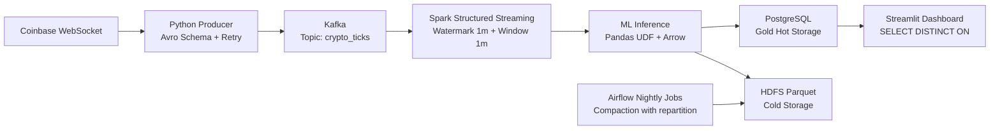

# 🚀 Real-time Crypto Data Pipeline

Pipeline xử lý dữ liệu **crypto thời gian thực** theo kiến trúc **Medallion (Bronze → Silver → Gold)**, triển khai trên cụm **Pseudo-Distributed** bằng Docker Compose.

## TL;DR
- **Nguồn dữ liệu:** Coinbase WebSocket (`BTC-USD`, `ETH-USD`)
- **Messaging:** Kafka topic `crypto_ticks` (key = `product_id`)
- **Processing:** Spark Structured Streaming + **Watermark 1 phút** + **Window 1 phút**
- **ML Inference:** Pandas UDF + Apache Arrow (`maxRecordsPerBatch=10000`)
- **Storage:** PostgreSQL (hot) + HDFS Parquet (cold)
- **BI:** Streamlit dashboard realtime

## Kiến trúc tổng quan



## Vì sao thiết kế này đúng hướng

### Bronze Layer (Ingestion)
- Producer nhận ticker realtime từ Coinbase.
- Chuẩn hóa record theo schema và publish vào Kafka.
- Mục tiêu: **throughput ổn định** + **khả năng replay**.

### Silver Layer (Processing)
- Spark đọc Kafka theo micro-batch.
- Dùng `withWatermark("event_time", "1 minute")` để xử lý dữ liệu đến trễ.
- Dùng window 1 phút để tạo **OHLCV**.
- Chạy inference bằng Pandas UDF với Arrow để tăng tốc vectorized execution.

### Gold Layer (Storage)
- Nhánh 1: ghi append vào PostgreSQL cho truy vấn BI nhanh.
- Nhánh 2: ghi Parquet lên HDFS cho lưu trữ lịch sử.
- PostgreSQL áp dụng partition + index để tối ưu truy vấn chuỗi thời gian.

## Tech Stack

- **Language:** Python
- **Streaming:** Apache Kafka, Apache Spark Structured Streaming
- **ML Runtime:** Pandas UDF, Apache Arrow
- **Storage:** PostgreSQL, Hadoop HDFS
- **Orchestration:** Apache Airflow
- **BI:** Streamlit, Plotly
- **Infra:** Docker Compose

## Quick Start

```bash
docker-compose up -d
python src/producer/producer.py
spark-submit --master spark://localhost:7077 src/spark/stream_processor.py
```

Dashboard: `http://localhost:8501`

## Tài liệu chi tiết

- [SRS](./docs/1_SRS.md)
- [Architecture](./docs/2_Architecture.md)
- [WBS Plan](./docs/3_WBS_Plan.md)