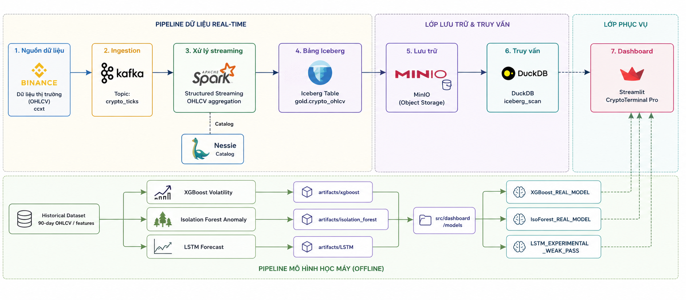

# IE212 Big Data Crypto Pipeline

## Near Real-time Crypto Lakehouse Pipeline with ML Signals

This repository implements a near real-time crypto data pipeline for a Big Data course demo. It streams BTC/USDT and ETH/USDT market data from Binance/ccxt into Kafka, aggregates candles with Spark Structured Streaming, writes Apache Iceberg data through Nessie into MinIO, and visualizes the latest data in a Streamlit dashboard using DuckDB.

The current dashboard, **CryptoTerminal Pro**, includes integrated research/demo ML signals: real XGBoost volatility prediction, real Isolation Forest anomaly detection, and an experimental weak-pass LSTM close-price forecast shown as reference only.

## Current Verified Architecture



The architecture has two main paths:
1. Near real-time serving pipeline:
  Binance/ccxt -> crypto-feeder -> Kafka -> Spark Structured Streaming -> Iceberg/Nessie/MinIO -> DuckDB -> Streamlit

2. Offline ML training pipeline:
  Historical dataset -> XGBoost / Isolation Forest / LSTM training -> model artifacts -> src/dashboard/models -> Streamlit ML signals

Running table:

```text
nessie.gold.crypto_ohlcv
```

Notes:

- DuckDB reads Iceberg data from MinIO using `httpfs` + `iceberg`.
- Nessie is used as the Iceberg catalog for Spark.
- The `src/dashboard/models` folder contains runtime model copies that the dashboard loads at startup.
- XGBoost and Isolation Forest are real, integrated model signals used by the dashboard.
- LSTM is experimental (weak-pass) and provided as reference-only inference; it does not override the real integrated signals.

This is near real-time, not hard real-time. Observed dashboard lag is usually seconds to tens of seconds depending on Spark microbatches, Iceberg commits, DuckDB reads, and Streamlit refresh timing.

## What Is Verified Today

- `crypto-feeder` publishes BTC/USDT and ETH/USDT messages to Kafka topic `crypto_ticks`.
- Kafka runs healthy under Docker Compose.
- Spark Structured Streaming reads Kafka and writes OHLCV candles to `nessie.gold.crypto_ohlcv`.
- Iceberg table data is stored in MinIO and tracked by Nessie.
- DuckDB can load `httpfs` and `iceberg`, find the latest Iceberg metadata in MinIO, and read at least one candle row.
- Streamlit dashboard renders the CryptoTerminal Pro UI, chart, KPIs, anomaly markers, and AI insight cards.
- XGBoost real models are integrated for BTC/USDT and ETH/USDT.
- Isolation Forest real models are integrated for BTC/USDT and ETH/USDT.
- LSTM is integrated as `LSTM_EXPERIMENTAL_WEAK_PASS`, reference-only inference.
- `scripts/ops/start.ps1` and `scripts/ops/status.ps1` pass in the verified demo state.

## Tech Stack

- Python
- Docker Compose
- Apache Kafka
- Apache Spark Structured Streaming
- Apache Iceberg
- Project Nessie
- MinIO object storage
- DuckDB with `httpfs` and `iceberg`
- Streamlit
- XGBoost
- scikit-learn
- TensorFlow/Keras
 - ccxt
 - joblib
 - pandas
 - numpy
 - boto3

## Folder Structure

```text
.
|-- docker-compose.yaml
|-- README.md
|-- requirements-ml.txt
|-- data/
|   `-- ml_training_data_90days.parquet
|-- docs/
|   `-- images/
|       `-- architecture.png
|-- artifacts/
|   |-- xgboost/
|   |   |-- xgboost_vol_btcusdt.pkl
|   |   `-- xgboost_vol_ethusdt.pkl
|   |-- isolation_forest/
|   |   |-- isolation_forest_btcusdt.pkl
|   |   |-- isolation_forest_ethusdt.pkl
|   |   |-- metrics_summary.json
|   |   |-- anomalies_btcusdt.png
|   |   `-- anomalies_ethusdt.png
|   `-- LSTM/
|       |-- lstm_btc_model.h5
|       |-- lstm_eth_model.h5
|       |-- scaler_btc.pkl
|       `-- scaler_eth.pkl
|-- simulator/
|   |-- Dockerfile
|   |-- requirements.txt
|   `-- simulator.py
|-- spark/
|   `-- Dockerfile
|-- spark-jobs/
|   |-- main.py
|   |-- spark_session.py
|   |-- table_creation.py
|   |-- data_processing.py
|   |-- iceberg_operations.py
|   |-- schemas.py
|   `-- __init__.py
|-- src/
|   `-- dashboard/
|       |-- Dockerfile
|       |-- requirements.txt
|       |-- app.py
|       |-- .dockerignore
|       `-- models/
|           |-- xgboost_vol_btcusdt.pkl
|           |-- xgboost_vol_ethusdt.pkl
|           |-- isolation_forest_btcusdt.pkl
|           |-- isolation_forest_ethusdt.pkl
|           |-- lstm_btc_model.h5
|           |-- lstm_eth_model.h5
|           |-- scaler_btc.pkl
|           `-- scaler_eth.pkl
|-- scripts/
|   `-- ops/
|       |-- start.ps1
|       |-- status.ps1
|       |-- logs.ps1
|       |-- stop.ps1
|       `-- reset-checkpoint.ps1
|-- xgboost_volatility_pipeline.py
|-- isolation_forest_anomaly_pipeline.py
`-- lstm_ml.ipynb
```

## Data Flow

1. `crypto-feeder` reads live Binance market data through ccxt.
2. The feeder publishes tick messages to Kafka topic `crypto_ticks`.
3. Spark Structured Streaming reads from Kafka.
4. Spark parses the tick stream and aggregates OHLCV candles.
5. Spark writes candles to Apache Iceberg table `nessie.gold.crypto_ohlcv`.
6. Iceberg table data and metadata are stored in MinIO under the `warehouse` bucket.
7. Nessie tracks the Iceberg catalog state.
8. The dashboard finds the newest Iceberg metadata file in MinIO.
9. DuckDB loads `httpfs` and `iceberg`, then reads data with `iceberg_scan(...)`.
10. Streamlit renders CryptoTerminal Pro: KPIs, chart, volume, anomaly markers, AI insight cards, and technical proof tabs.

## Docker Compose Services

| Service | Container | Purpose | Ports |
| --- | --- | --- | --- |
| `catalog` | `catalog` | Nessie catalog | internal `19120` |
| `storage` | `storage` | MinIO object storage | `9000`, `9001` |
| `mc` | `mc` | MinIO bucket setup | none |
| `kafka` | `kafka` | Kafka broker and topic setup | `9092` |
| `spark` | `spark-master` | Spark streaming job | `4040`, `7077` |
| `crypto-feeder` | `crypto-feeder` | Binance/ccxt Kafka producer | none |
| `dashboard` | `crypto-dashboard` | Streamlit dashboard | `8501` |

## ML Model Status

| Model | Task | Baseline | Status | Dashboard Role |
| --- | --- | --- | --- | --- |
| LSTM | Close forecasting | Naive Forecast | Weak pass | Reference-only inference |
| XGBoost | Volatility prediction | Volatility baseline | Accepted | Volatility risk |
| Isolation Forest | Anomaly detection | `abs(z_score) > 3` | Integrated | Anomaly detection |

### XGBoost

- Task: volatility prediction.
- Real model integrated into the dashboard.
- Dashboard labels:
  - `XGBoost_REAL_MODEL (BTC/USDT)`
  - `XGBoost_REAL_MODEL (ETH/USDT)`
- Artifacts:
  - `artifacts/xgboost/xgboost_vol_btcusdt.pkl`
  - `artifacts/xgboost/xgboost_vol_ethusdt.pkl`
  - `src/dashboard/models/xgboost_vol_btcusdt.pkl`
  - `src/dashboard/models/xgboost_vol_ethusdt.pkl`
- The dashboard uses artifact-provided `feature_columns`.
- The dashboard uses corrected `next_zero_proxy(...)` logic consistent with training.

### Isolation Forest

- Task: unsupervised anomaly detection.
- Real model integrated into the dashboard.
- Dashboard labels:
  - `IsoForest_REAL_MODEL (BTC/USDT)`
  - `IsoForest_REAL_MODEL (ETH/USDT)`
- Artifacts:
  - `artifacts/isolation_forest/isolation_forest_btcusdt.pkl`
  - `artifacts/isolation_forest/isolation_forest_ethusdt.pkl`
  - `artifacts/isolation_forest/metrics_summary.json`
  - `artifacts/isolation_forest/anomalies_btcusdt.png`
  - `artifacts/isolation_forest/anomalies_ethusdt.png`
  - `src/dashboard/models/isolation_forest_btcusdt.pkl`
  - `src/dashboard/models/isolation_forest_ethusdt.pkl`
- Features: `volume`, `log_returns`, `z_score`, `volatility_30m`.
- Contamination: `0.03`.
- Dashboard `volatility_30m` is the rolling standard deviation of `log_return`, not close price.
- Dashboard shows anomaly count and anomaly rate for the current chart view.

### LSTM

- Task: close price forecasting.
- Khôi's LSTM artifacts are integrated into the dashboard as reference-only inference.
- Dashboard labels:
  - `LSTM_EXPERIMENTAL_WEAK_PASS (BTC/USDT)`
  - `LSTM_EXPERIMENTAL_WEAK_PASS (ETH/USDT)`
- Artifacts:
  - `artifacts/LSTM/lstm_btc_model.h5`
  - `artifacts/LSTM/lstm_eth_model.h5`
  - `artifacts/LSTM/scaler_btc.pkl`
  - `artifacts/LSTM/scaler_eth.pkl`
  - `src/dashboard/models/lstm_btc_model.h5`
  - `src/dashboard/models/lstm_eth_model.h5`
  - `src/dashboard/models/scaler_btc.pkl`
  - `src/dashboard/models/scaler_eth.pkl`
- Model shape: input `(None, 60, 2)`, output `(None, 1)`.
- LSTM is not production-ready and does not override XGBoost or Isolation Forest outputs.

## ML Metrics

### XGBoost

| Symbol | Baseline Test RMSE | XGBoost Test RMSE | Status |
| --- | ---: | ---: | --- |
| BTC/USDT | `2.3631859713898763e-05` | `1.767691660057757e-05` | Passed baseline |
| ETH/USDT | `4.116352038788613e-05` | `3.043713735124203e-05` | Passed baseline |

### Isolation Forest

| Symbol | Contamination | Baseline | Dashboard Result |
| --- | ---: | --- | --- |
| BTC/USDT | `0.03` | `abs(z_score) > 3` | View-dependent anomaly count/rate |
| ETH/USDT | `0.03` | `abs(z_score) > 3` | View-dependent anomaly count/rate |

Isolation Forest is unsupervised, so dashboard anomaly counts depend on the currently loaded candle window.

### LSTM

| Symbol | Baseline RMSE | LSTM RMSE | Interpretation |
| --- | ---: | ---: | --- |
| BTC/USDT | `34.7801` | `34.7795` | Weak pass |
| ETH/USDT | `1.2921` | `1.2920` | Weak pass |

LSTM only barely beats the naive baseline, so it is shown as experimental/reference-only inference rather than a strong production forecasting signal.

## Run On Windows PowerShell

From the repository root:

```powershell
docker compose config
docker compose build
docker compose up -d
docker compose ps
```

Open:

```text
http://localhost:8501/
```

Useful local URLs:

```text
Streamlit dashboard: http://localhost:8501/
MinIO console:       http://localhost:9001/    user: admin, password: password
Spark UI:            http://localhost:4040/
```

## Reliable Demo Startup

After Docker Desktop restarts, start the full stack with:

```powershell
powershell -ExecutionPolicy Bypass -File .\scripts\ops\start.ps1
```

Do not open only the dashboard after a Docker restart. The dashboard may still read old Iceberg data from MinIO even when Kafka, Spark, Nessie, or the feeder are not active.

If the dashboard shows `Stalled`, run:

```powershell
powershell -ExecutionPolicy Bypass -File .\scripts\ops\start.ps1
powershell -ExecutionPolicy Bypass -File .\scripts\ops\status.ps1
```

Use `reset-checkpoint.ps1` only for Spark checkpoint/state recovery.

## Operational Scripts

| Script | Purpose |
| --- | --- |
| `scripts/ops/start.ps1` | Validates Compose config, builds images, starts the full stack, waits for core service health, checks feeder output, checks Spark writes, and checks dashboard HTTP 200. |
| `scripts/ops/status.ps1` | Shows service status, checks catalog/storage/Kafka health, checks Spark write evidence, performs a real DuckDB/Iceberg row read from the dashboard container, and checks dashboard reachability. |
| `scripts/ops/logs.ps1` | Prints useful recent logs for `crypto-feeder`, `spark`, `dashboard`, `catalog`, and `kafka`. |
| `scripts/ops/stop.ps1` | Stops services without deleting volumes, MinIO data, Iceberg data, or Nessie data. |
| `scripts/ops/reset-checkpoint.ps1` | Deletes only the Spark OHLCV streaming checkpoint and restarts Spark. |

Direct execution:

```powershell
.\scripts\ops\status.ps1
```

If PowerShell blocks scripts:

```powershell
powershell -ExecutionPolicy Bypass -File .\scripts\ops\status.ps1
```

Manual checkpoint recovery deletes only:

```text
s3a://warehouse/checkpoints/ohlcv/
minio/warehouse/checkpoints/ohlcv
```

It does not delete Iceberg table data, Nessie catalog data, MinIO warehouse data, or Docker volumes.

## Verify Each Layer

### Feeder

```powershell
docker compose logs --tail 100 crypto-feeder
```

Expected evidence:

```text
Kafka BTC/USDT
Kafka ETH/USDT
```

### Kafka

```powershell
docker compose ps kafka
```

Expected state: `kafka` is running and healthy.

Optional topic check:

```powershell
docker compose exec kafka kafka-topics --bootstrap-server kafka:9092 --list
```

Expected topic:

```text
crypto_ticks
```

### Spark Structured Streaming

```powershell
docker compose logs --tail 200 spark
```

Expected evidence:

```text
Batch <n> written to nessie.gold.crypto_ohlcv
spark.sql.shuffle.partitions -> 4
```

### Nessie and MinIO

```powershell
docker compose ps catalog storage
```

Expected state: both services are running and healthy.

### Dashboard

```powershell
docker compose logs --tail 150 dashboard
```

Expected state: no critical errors for DuckDB, `httpfs`, `iceberg`, S3 credentials, missing metadata, or Streamlit crash.

Open:

```text
http://localhost:8501/
```

### DuckDB/Iceberg Data Check

The status script performs the recommended data check:

```powershell
powershell -ExecutionPolicy Bypass -File .\scripts\ops\status.ps1
```

Expected evidence:

```text
PASS: DuckDB can read at least one Iceberg candle row
```

## Dashboard Guide

CryptoTerminal Pro shows:

- Pipeline status: running/stalled from dashboard-side latest candle freshness.
- Latest data timestamp.
- Observed lag.
- Selected symbol.
- Latest close price.
- Candlestick/price chart and volume.
- Isolation Forest anomaly markers.
- AI insight cards for XGBoost, Isolation Forest, and LSTM.
- Technical details tabs:
  - Pipeline Details
  - Model Evaluation
  - Architecture
  - Raw OHLCV

Model status labels to expect:

```text
XGBoost_REAL_MODEL (BTC/USDT)
XGBoost_REAL_MODEL (ETH/USDT)
IsoForest_REAL_MODEL (BTC/USDT)
IsoForest_REAL_MODEL (ETH/USDT)
LSTM_EXPERIMENTAL_WEAK_PASS (BTC/USDT)
LSTM_EXPERIMENTAL_WEAK_PASS (ETH/USDT)
```

## Known Limitations

- This is near real-time, not hard real-time.
- The dashboard scans the latest Iceberg metadata directly from MinIO using DuckDB rather than querying through Nessie APIs.
- The project does not implement a full Bronze/Silver/Gold Medallion architecture; the verified streaming output is `nessie.gold.crypto_ohlcv`.
- The feeder depends on Binance/network access.
- LSTM is weak-pass experimental/reference-only inference and should not be described as production-ready.
- ML signals are research/demo signals and are not financial advice.
- XGBoost pickle compatibility warnings may appear in logs; they are non-blocking for the current demo.
- Streamlit deprecation warnings may appear; they are non-blocking.
- Port `8501` can conflict with unrelated local Streamlit processes.

## Troubleshooting

### Docker daemon is not running

Start Docker Desktop, wait for the engine, then run:

```powershell
docker compose ps
```

### Dashboard shows Stalled

Start the full stack and verify status:

```powershell
powershell -ExecutionPolicy Bypass -File .\scripts\ops\start.ps1
powershell -ExecutionPolicy Bypass -File .\scripts\ops\status.ps1
```

### DuckDB extension issue

Rebuild the dashboard image with network access:

```powershell
docker compose build dashboard
docker compose run --rm --no-deps dashboard python -c "import duckdb; c=duckdb.connect(':memory:'); c.execute('LOAD httpfs;'); c.execute('LOAD iceberg;'); print('duckdb extensions loaded')"
```

### Spark checkpoint preserves old config

If Spark logs show old streaming settings, reset only the OHLCV checkpoint:

```powershell
powershell -ExecutionPolicy Bypass -File .\scripts\ops\reset-checkpoint.ps1
```

Do not run `docker compose down -v` for normal recovery.

### Binance or network issue

Check feeder logs:

```powershell
docker compose logs --tail 120 crypto-feeder
```

The feeder uses live Binance/ccxt behavior and does not automatically switch to a fake simulator.

### Port 8501 conflict

Check which process owns the port:

```powershell
Get-NetTCPConnection -LocalPort 8501
```

Stop only unrelated local Streamlit processes if they conflict with the Docker dashboard.

## Current Demo Readiness

The project is ready for a Big Data course demo as a near real-time crypto lakehouse pipeline with integrated ML research/demo signals:

```text
Binance/ccxt -> crypto-feeder -> Kafka -> Spark Structured Streaming -> Iceberg/Nessie/MinIO -> DuckDB -> Streamlit
```

Recommended demo command:

```powershell
powershell -ExecutionPolicy Bypass -File .\scripts\ops\start.ps1
```
